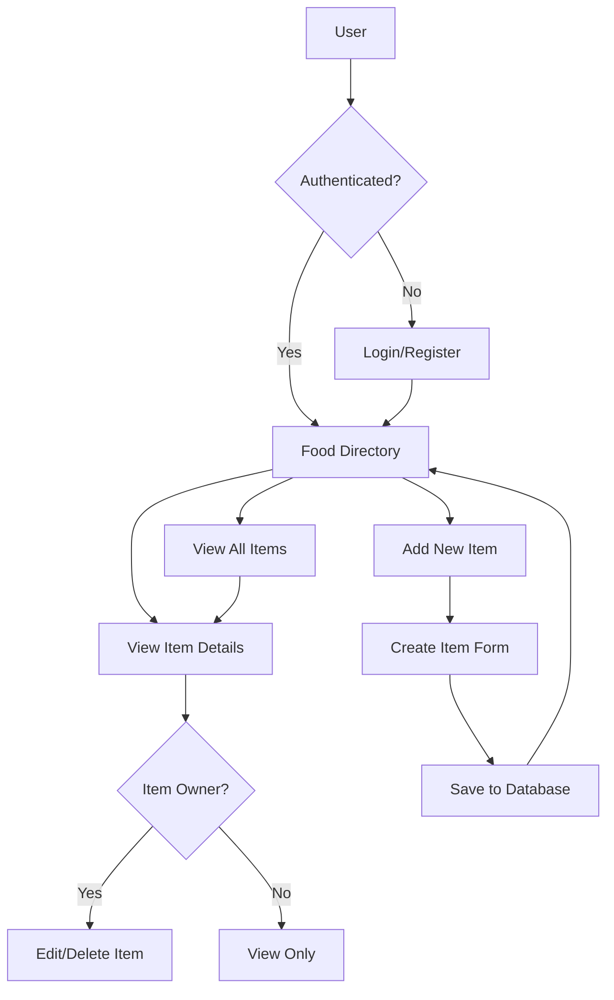
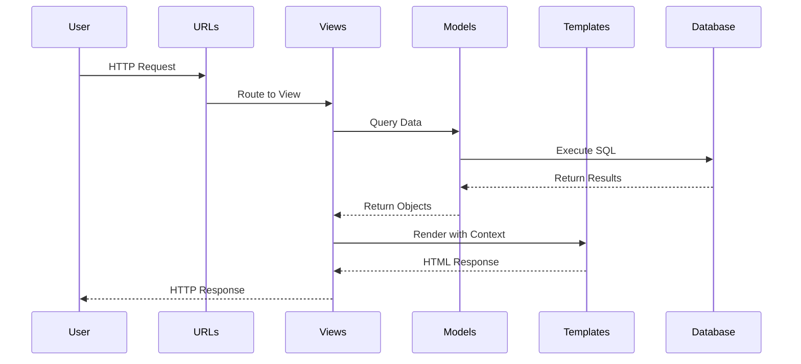
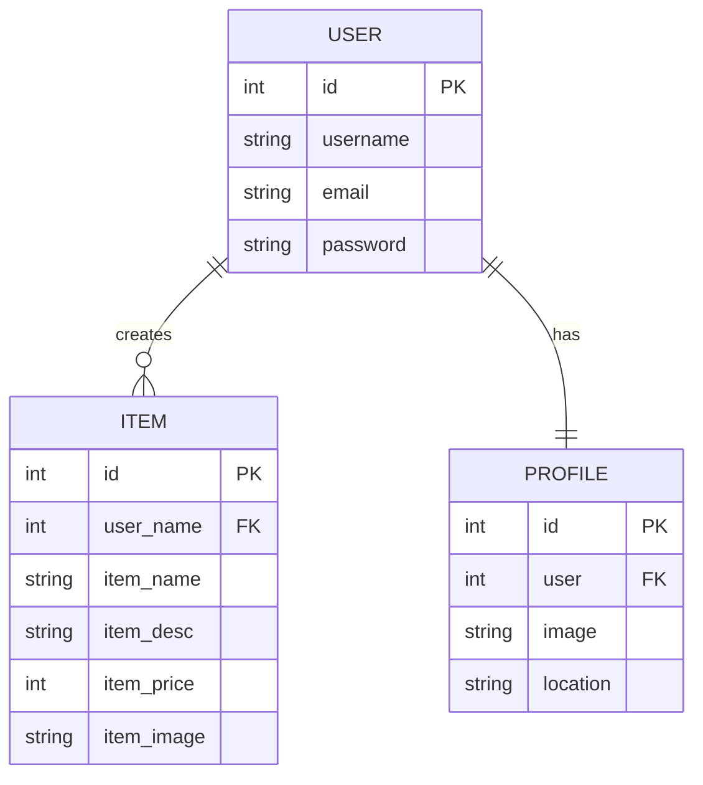

# Django Food Menu Application

#### Current status: Complete

___

### Personal Progress
* **What I learned**: Django fundamentals including MVT architecture, class-based views, Django ORM for database operations, user authentication and authorization, form handling, template inheritance, static file management, and URL routing
* **What I wish I had done differently**: Implemented more comprehensive form validation earlier and added better error handling throughout the application
* **What I am most proud of**: Successfully refactoring from function-based views to class-based views while maintaining all functionality, and implementing user-specific edit permissions to prevent unauthorized modifications
* **What I want to learn next**: Adding API endpoints with Django REST Framework, implementing advanced search and filtering, adding unit tests, and deploying the application to a production environment

## Description
This is a full-featured food menu management application built as the first project in my Django learning journey. Users can register accounts, browse a shared food menu, and create their own menu items with images, descriptions, and pricing. The application demonstrates core Django concepts including user authentication, CRUD operations, and database relationships.

The system allows authenticated users to add food items to a shared directory, view detailed information about each item, and manage (edit/delete) only the items they've created. The application uses Django's built-in authentication system and implements authorization controls to ensure users can only modify their own content.

## Screenshot
<!-- Drop your screenshot here -->

## How It Works
This diagram provides a high-level view of the application architecture:



The request-response flow shows how Django processes user interactions:



The database schema illustrates the relationships between models:



## Features
This describes the key capabilities implemented in the application:

- **User Authentication**: Complete registration, login, and logout functionality using Django's built-in authentication system
- **User Profiles**: Each user has a profile with customizable profile picture and location information
- **Food Item Management**: Full CRUD operations for menu items including name, description, price, and image
- **Authorization Controls**: Users can only edit or delete items they've created, preventing unauthorized modifications
- **Image Support**: Menu items include images with fallback to default placeholder images
- **Responsive UI**: Tailwind CSS styling for a modern, responsive user interface
- **Class-Based Views**: Leverages Django's generic views (ListView, DetailView, CreateView, UpdateView, DeleteView) for cleaner code
- **Form Validation**: Django forms with built-in validation for data integrity
- **Success Messages**: User feedback through Django's messages framework

## Application Structure

This describes the architecture and organization of the Django project:

### Django Apps
The project is organized into two main Django apps:

1. **food**: Manages the menu items and food-related functionality
   - Models: `Item` (food menu items)
   - Views: Food directory, item details, create/update/delete operations
   - Templates: Item listing, detail views, forms

2. **users**: Handles user authentication and profile management
   - Models: `Profile` (user profile information)
   - Views: Registration, login, logout, profile display
   - Templates: Authentication forms, profile page

### View Evolution
The project demonstrates Django view patterns by preserving commented-out function-based views alongside their class-based replacements:

**Function-Based Views (Original)**:
```python
def index(request):
    item_list = Item.objects.all()
    return render(request, "food/index.html", {"item_list": item_list})
```

**Class-Based Views (Refactored)**:
```python
class FoodDirectoryView(ListView):
    model = Item
    template_name = 'food/index.html'
```

This evolution is visible in `food/views.py:13-93` where both implementations are preserved for educational purposes.

### URL Structure
The application uses a hierarchical URL configuration:

- `/admin/` - Django admin interface
- `/food/` - Food item directory (main app)
  - `/food/<id>/` - Individual item details
  - `/food/add/` - Create new item
  - `/food/update/<id>/` - Edit existing item
  - `/food/delete/<id>/` - Delete item
- `/users/` - User authentication
  - `/users/register/` - New user registration
  - `/users/login/` - User login
  - `/users/logout/` - User logout
  - `/users/profile/` - User profile page

### Key Implementation Details

**User-Specific Item Creation** (`food/views.py:58-60`):
```python
def form_valid(self, form):
    form.instance.user_name = self.request.user
    return super().form_valid(form)
```
Automatically associates new items with the logged-in user without exposing this field in the form.

**Edit Protection** (`food/views.py:81-82`):
```python
def get_queryset(self):
    return Item.objects.filter(user_name=self.request.user)
```
Ensures users can only access the update view for their own items.

**Authentication Integration** (`DjangoCourseMenuApp/settings.py:132-134`):
```python
LOGIN_REDIRECT_URL = 'food:index'
LOGIN_URL = 'login'
```
Configures automatic redirection after successful login and protects views requiring authentication.

## Files
This describes the role of key files in the application:

### Core Application Files
- **manage.py**: Django's command-line utility for administrative tasks
- **DjangoCourseMenuApp/settings.py**: Project configuration including installed apps, middleware, database settings, and static file handling
- **DjangoCourseMenuApp/urls.py**: Root URL configuration that routes to app-specific URL patterns

### Food App
- **food/models.py**: `Item` model defining menu item structure with user relationship
- **food/views.py**: Class-based views for listing, displaying, creating, updating, and deleting menu items
- **food/urls.py**: URL patterns for food-related views
- **food/forms.py**: ModelForm for item creation and editing
- **food/templates/food/base.html**: Base template with navigation and TailwindCSS styling
- **food/templates/food/index.html**: Menu directory listing all items
- **food/templates/food/detail.html**: Individual item detail view
- **food/templates/food/item_form.html**: Form for creating new items
- **food/templates/food/item_update_form.html**: Form for editing existing items
- **food/templates/food/item_confirm_delete.html**: Confirmation page for item deletion

### Users App
- **users/models.py**: `Profile` model extending Django's User model with additional fields
- **users/views.py**: Views for registration, login, logout, and profile display
- **users/urls.py**: URL patterns for authentication and profile views
- **users/forms.py**: `RegisterForm` extending Django's UserCreationForm with email field
- **users/templates/users/register.html**: User registration form
- **users/templates/users/login.html**: User login form
- **users/templates/users/logout.html**: Logout confirmation page
- **users/templates/users/profile.html**: User profile display

### Database
- **db.sqlite3**: SQLite database containing all application data

## Technical Stack

**Framework & Core Technologies**:
- **Django 5.2.6**: Full-stack web framework for rapid development
- **SQLite**: Lightweight database for development
- **Python 3.x**: Backend programming language

**Frontend**:
- **TailwindCSS (CDN)**: Utility-first CSS framework for responsive design
- **Django Template Language**: Server-side template rendering

**Key Django Features Used**:
- **Django ORM**: Database abstraction layer for model operations
- **Django Authentication**: Built-in user authentication and authorization
- **Django Forms**: Form handling and validation
- **Generic Class-Based Views**: Reusable view components for common patterns
- **Django Messages**: User feedback and flash messages
- **Django Admin**: Built-in admin interface for data management
- **Static Files Handling**: Management of CSS, JavaScript, and images
- **Media File Upload**: User-uploaded profile pictures and item images

**Project Highlights**:
- Migration from function-based to class-based views demonstrating understanding of Django's view patterns
- Implementation of user-specific authorization ensuring data security
- Template inheritance for DRY (Don't Repeat Yourself) principles
- Integration of external CSS framework (TailwindCSS) with Django templates

## License

This project is a learning exercise and is available for reference under the [MIT License](LICENSE).